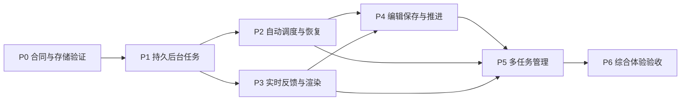

# 自动化生产工作台：阶段计划与验收台账

- 日期：2026-09-22；模式：Execute ADR；实施起点：`09fdde9`。
- 当前执行：P0 **PASSED**（`27fc2b4`）；P1 **PASSED**（`fc773ce`）；P2 **PASSED**（`d221cfc`）；P3 **PASSED**（`5a6277b`）；P4 **PASSED**；P5—P6 未开始。
- 需求原文：[REQ-20260922-PIPELINE](sources/20260922-automated-production-workspace.md)。
- 决策：[调度 ADR-0004](0004-durable-production-scheduler.md)、[实时反馈 ADR-0005](0005-realtime-rendering-feedback.md)、[编辑与管理 ADR-0006](0006-multitask-editing-workbench.md)。

用户已明确多任务自动流水线、实时反馈、编辑保存推进的目标，以及报价禁改。2026-09-22 用户明确要求“现在开始按照adr顺序推进”，据此接受三份 ADR 并进入执行；技术参数仍按阶段验证，不把接受方案等同于测试通过。

## 范围与合同

保留九步工作流、人工确认、版本血缘与已有成果。本计划不新增或重做报价确认、价格/费用/积分展示、计费策略或支付；既有 QUOTE 的实现、载荷、呈现和校验不变。FrameFlow 仅作源码参照，ADR-0002 不自动纳入执行。

实施前更新长期规格 [videosbatch-workflow-canonical.md](../../specs/videosbatch-workflow-canonical.md) 与 [ui-system.md](../../specs/ui-system.md)，将已接受的规则映射到验收条件。本轮不把尚未接受的提案写成现行产品合同。ADR 记录选择与理由，spec 定义业务行为，本文件是 ADR-0004—0006 的唯一阶段状态台账。

## 阶段依赖

推荐按 P0 → P1 → P2 → P3 → P4 → P5 → P6 串行落地。图表示逻辑依赖，不意味着可多人同时修改主分支。每阶段独立提交、核验，再进入下一阶段；保留无关工作。

| 阶段 | 对应 ADR | 进入条件 | 交付与通过条件 | 状态 |
|---|---|---|---|---|
| P0 合同与存储验证 | 0004/0005/0006 | 开始实施的用户指令；核对基线 | 规格、状态机和模块边界；Windows/Node SQLite 验证；跨存储恢复原型证明；确认实施方案 | PASSED |
| P1 持久后台任务 | 0004 | P0 通过 | 异步运行 API、持久 Run/Attempt/Event、单写入投影、同一引擎兼容旧调用、owner 隔离 | PASSED |
| P2 自动调度与恢复 | 0004 | P1 通过 | 依赖/限额/公平队列、确认关卡、暂停继续、重启恢复、未知受理核对；合成证据后才提高并发 | PASSED |
| P3 实时反馈与渲染 | 0005 | P1 通过 | SSE/快照续接、局部渲染、真实预览、断线兜底、阅读不被打断 | PASSED |
| P4 编辑保存与推进 | 0006 | P2/P3 通过 | 草稿层、编辑占用、版本冲突、指定版本保存并推进、失败补偿、输入保护 | PASSED |
| P5 多任务管理 | 0006 | P2/P3/P4 通过 | 增强现有任务页、待处理中心、批量操作、局部镜头控制、上下文保持 | NOT_STARTED |
| P6 综合体验验收 | 全部 | P1—P5 通过 | 故障故事验收、性能数据、浏览器/键盘/响应式证据、离线回归、回退演练 | NOT_STARTED |

## 各阶段验证设计

以下均为**计划中的验证**，不是已存在或已运行的测试。FR/TR 的精确映射以各 ADR 表格为准。

### P0：先证明持久性边界

- 记录当前 Node 版本、SQLite 驱动候选及维护/许可证证据；在目标 Windows 环境验证安装、打包、事务、备份恢复。未确定驱动前不向业务代码引入未经验证的依赖。
- 用合成数据在结果文件写入、控制事务提交、JSON 投影完成、投影确认四个边界注入崩溃。重启后必须收敛到一个成果版本，未完成投影不能触发下游。
- 定义 expectedRevision、幂等键、运行/成果身份、编辑占用、事件游标范围及保留策略；定义已有与新增状态的映射和恢复行为。
- 明确单写入者的进程约束；不能以 SQLite 有事务推断既有 JSON 可以多进程写入。若成本或正确性不成立，修订 ADR 后再推进。
- 规格验收明确报价不变、同一执行引擎、旧 CLI 兼容。通过 `npm run smoke:specs`。

### P1：后台运行与旧入口一致

- 请求只在持久接收后返回 runId；关页/断线后工作仍可查询；同请求重放返回同一运行。
- 新异步 API 与旧同步等待适配器共用一个执行者。并发调用两种入口不得产生重复 Provider 提交。
- 验证读取、写入、恢复、事件订阅与批量入口的 owner 范围；未经授权不能通过猜 runId 或 cursor 访问其他项目。
- 重启恢复已有任务和待投影结果。外部提交已发生但回执未知的情形保留核对状态，不靠盲目重发“恢复”。

### P2：自动化是可控的

- 可控执行器证明独立工作存在执行重叠、依赖工作不会提前提交；最终成果按原 sequence 排序。
- 五个项目中一个等确认、一个失败、一个暂停，其余仍可推进。验证全局/owner/session/Provider 限额、队列上限与等待公平性。
- 暂停后不再派单，重启保持暂停意图；停止后续和取消在途区分；没有真实取消能力时不显示该操作。
- 复用成功结果时检查输入版本；有外部 taskId 先恢复轮询；未知受理不得自动新建任务。
- 确认关卡与引用快照照旧校验。记录并发参数和测量条件，不能借用其他项目的容量结论。

### P3：断线之后仍看见真相

- 在快照/订阅交界注入事件，并覆盖重复、乱序、间断、游标过期、终态掉线。恢复后状态与服务端一致，执行次数不增加。
- 检查代理缓冲、心跳、连接断开和回退轮询；本地测试与实际部署网络验证分开记录。
- 模拟支持流式和不支持流式的适配器：完整可校验块才作临时预览，正式成果只能在保存确认后出现。
- 高频事件下上翻不追尾、正在输入的内容不被覆盖、展开块和选中步骤保留；后台标签恢复后补齐状态。
- aria-live 不逐 token 播报，reduced-motion 生效；没有阶段证据时不展示虚假百分比。

### P4：编辑、保存、推进有版本依据

- 两个标签编辑同一版本触发可恢复冲突，保留两份内容；旧运行晚到不能覆盖新版本。
- 保存慢响应期间继续输入、切项目和重新挂载；确认响应只能清理对应提交的草稿。离线与保存失败不能显示已保存。
- 编辑占用与自动派单竞争有明确先后；占用未被服务端接受时不承诺已冻结。若任务已经启动，显示冻结的输入版本并保护新草稿。
- “保存”不启动生成；“保存并继续”固定目标 revision。覆盖保存失败、保存成功入队失败、重复点击、响应丢失和服务重启，补偿不重复发布/执行。
- 区分本地标签页缓存与已同步服务端草稿：前者只按实际浏览器存储保证恢复，后者才可承诺重开浏览器恢复。不得承诺离线关闭标签后必定保留未同步内容。
- 修改只使实际依赖的下游失效，旧结果可查看，无关项目继续运行。

### P5：管理大量任务仍能直接操作

- 批量操作涵盖适用与不适用项、部分成功、部分失败、重复点击；逐项展示结果并保持权限隔离。
- 待处理项直达对应阶段/镜头；返回列表恢复筛选和滚动，切项目恢复步骤、展开块、焦点和草稿。
- 单镜头/选中镜头重做仅提交选中项，依赖不满足时解释原因，不静默扩大范围。
- 在多个后台任务运行时持续搜索、编辑与保存，不能出现整页 busy 锁。优先级调整只作用于未开始任务。
- 覆盖键盘操作、编辑器内保存快捷键、弹窗关闭还焦，以及 390/768/1440px 布局。

### P6：完整用户故事与性能

固定故事：同时管理五个项目，A 自动执行、B 待人工确认、C 一项失败、D 正在编辑、E 排队；切换各项目、批量暂停、重试 C 的失败项、保存 D 并继续、确认 B，期间断开事件连接并重启服务。最终每个运行、输入版本和成果均可对应；未选项未提交，成功项未重复生成，编辑内容不丢失。

- 使用 ADR-0005 的固定合成负载与采样规则记录 p95、长任务、样本数和环境；性能目标未测前不得标通过。
- 浏览器证据包括真实 DOM 操作、保存后回读、刷新恢复、交互时延和无障碍检查；截图只能证明外观。
- 完成 `npm run smoke:specs`、`npm run verify:offline` 及变更对应回归。协议模拟不等于真实 Provider 支持；另列未验能力。
- 合成数据演练备份恢复、关闭新视图、同步模式降级、停止派单后引擎回退；活跃任务有去向且旧草稿不被删除。
- 报价范围做最终差异审查，既有校验继续通过。真实 Provider、生产迁移和发布不因通过离线验收自动授权。

## 审查与证据规则

后续执行阶段按 `adr-driven-delivery` 进行独立只读审查；每阶段最多三轮审查、两轮返工，仍有关键问题时记录未解决证据，不将状态改为完成。实施者负责核验审查发现与具体代码，不机械接受无证据建议。

每阶段回填：提交 SHA、需求 ID、命令/退出码、浏览器证据路径、失败后修正、未验证边界及审查结论。相关改动完成后按明确文件清单提交；不得把无关文件纳入。

| 记录 | 当前证据 |
|---|---|
| 架构基线 | 同会话源码核对，VideosBatch `6cc8174`、FrameFlow `7d7af229`；不是性能对跑 |
| 文档检查 | 2026-09-22：6 份新增文档的 31 个相对链接/显式锚点全部有效；需求映射与禁改范围人工核对；`npm run smoke:specs` 退出 0（8 specs） |
| 实施/故障/性能测试 | 未开始；此前可靠性修复与 UI 验收不能充当新增能力证据 |
| 生产与真实 Provider | 未执行 |

## 需要以证据确定的技术参数

SQLite 驱动与运行时兼容性、事件保留窗口、各层并发/队列上限、列表窗口化阈值、Provider 流式/取消能力，都在对应阶段验证后记录。默认不阻塞本次 ADR 写作，也不能在实施时静默当作已验证事实。

## 执行记录

- 2026-09-22，实施者：用户请求按 ADR 顺序推进；`09fdde9` 干净 master。P0 NOT_STARTED → PROPOSED → IN_PROGRESS。沿用本会话提交/推送授权，生产、付费调用及报价范围不变。

### P0 工作证据（审查中）

- 选择 Node 内置 `node:sqlite`，本机 Node v22.22.0、SQLite 3.50.4；无新增 npm/native 编译依赖。依赖的 backup API 要求 Node >=22.16；Node22 的 SQLite 仍属实验性，封装在独立模块，不把实验 API 当稳定长期合同。[官方 Node API](https://nodejs.org/download/release/v22.13.1/docs/api/sqlite.html)；[backup 版本记录](https://nodejs.org/download/release/v25.1.0/docs/api/sqlite.html)。Node/SQLite 随 Node 发行维护，发行包含许可；没有下载第三方驱动。
- `src/server/productionRuns/projectionJournal.ts` 是隔离控制仓库原语，尚未在业务服务启动时加载或创建数据。单写入者由宿主保证；P1 必须把 operationId 与真实成果原子保存并做集成测试，不能把本原型测试当作接线证明。
- `npx tsx scripts/smoke-production-storage.ts` 退出 0：真实子进程退出四个边界、重复回放仅一个 revision、事务回滚、幂等冲突、SQLite 在线备份/恢复、结果损坏和路径穿越拒绝。测试只写随机系统临时目录；本轮证据 `videosbatch-storage-72qkcM`。
- `npx tsc --noEmit`、`npm run smoke:specs` 均退出 0。P0 原型没有 Provider 副作用，也未打开用户 data。
- P0 IN_PROGRESS → REVIEW_1，独立审查者 `review_storage_p0`；结论待回传。备份测试为暂停业务的合成场景，生产备份必须协调台账、成果文件与 JSON 的同一边界。

- P0 REVIEW_1 → REWORK_1：独立审查发现备份测试未包含 JSON 成果。修改为停写窗口共同备份 DB/results/JSON，断言恢复的 revision/operationId/artifact 和重放不重复；方法命名明确只备份控制库。
- P0 REWORK_1 → REVIEW_2 → ACCEPTANCE → PASSED：`review_storage_p0` 第2轮 PASS；`npm run smoke:production-storage` 退出0（证据 `videosbatch-storage-ZgzRvc`）；`npm run build`、tsc、specs均通过。接受范围是单写入者进程退出恢复，未宣称断电/生产证据。
- 运行时合同：执行模块要求 Node >=22.16（本机22.22，CI与Docker配置均为22系列）；P1 接线增加启动版本检查。同步 SQLite 仅用于小型控制事务，性能在P6测量。

- P1 NOT_STARTED → PROPOSED → IN_PROGRESS：基线 `27fc2b4`，P0通过且工作区干净。实现者开始持久运行、既有API适配与owner隔离。

### P1 验证与审查（进行中）

- 新增 shared Run 状态合同、SQLite Run/WorkItem/Attempt/事件记录；HTTP 异步入口返回202，旧入口等候同一个执行器。返回结果在校验/投影前保存以供恢复；JSON与operationId一起检查点，崩溃后恢复结果不重复调用执行器。
- `smoke:production-runs`：新旧入口交叠只执行一次、重复请求回同一run、跨owner拒绝、非法mode拒绝；三个真实子进程退出点（受理未知/结果已返回/JSON已投影）重启无重复提交。证据临时目录 `videosbatch-runs-crash-MAdH8D`，退出0。
- `smoke:adr0003-api`、`smoke:videosbatch-api-retry`、stage-registry-injection、tsc通过。新增长寿命数据库后，原测试显式关闭engine再清理临时目录。
- 单写入锁在服务端 store.load 前取得；SQLite原语不承担多进程业务调度。Provider取消、限额、公平调度和编辑并发属于后续阶段，尚未宣称完成。

- P1 IN_PROGRESS → REVIEW_1：独立审查者 `review_runs_p1`。最新单写入保护使用独立SQLite连接持有文件锁，`smoke:production-writer`证明第二进程拒绝、SIGKILL后可重新取得锁；最新运行恢复证据 `videosbatch-runs-crash-hf2e1C`。secrets/specs通过。

- P1 REVIEW_1 → REWORK_1：三项发现为活跃run复用遗漏requestId映射、不同mode被吞掉、明确restart被历史reconciling挡住。新增持久request alias、mode冲突409、显式新意图ID与旧运行归档；普通重放不解除未知受理保护。增加完成/重启重放与显式重启测试，退出0（`videosbatch-runs-crash-9ynVLl`）。
- P1 REVIEW_2 → REWORK_2：迟到的旧任务异常可把已cancelled改回reconciling。异常路径保留取消终态；新增真实session flight保存屏障，旧worker排在reset之后，确认新项目仍能执行。第3轮审查待结论。

- P1 REVIEW_3 → ACCEPTANCE → PASSED：`review_runs_p1` 第3轮PASS，两个返工周期结束。最新屏障+崩溃测试 `videosbatch-runs-crash-yzyl0O`，tsc退出0。
- P1完整离线回归采用隔离副本 `C:/Users/HB/AppData/Local/Temp/videosbatch-p1-verify-_9kzsty1`，不复制.env/data，强制fake。初次缺Git元数据、复制时遗漏Git引号包裹的中文路径、续跑未继承npm的tsx PATH，均为验证环境问题，已修复；按原 verify:offline 顺序保留成功前缀并从失败命令续跑，所有检查最终通过。日志：verify-p1.log、verify-p1-remaining.log、verify-p1-final.log；末段退出0，新故障恢复证据 `videosbatch-runs-crash-MLNg7A`。没有修改测试断言来绕过环境失败。
- P1交付边界：后台运行与恢复已通过隔离集成/旧接口回归；P2调度控制、P3实时界面、P4编辑和P5管理未开始。无真实Provider或生产验收。

- P2 NOT_STARTED → PROPOSED → IN_PROGRESS：`fc773ce`已推送且工作区干净，开始调度控制、依赖并行与恢复验证。

### P2 验证与审查（进行中）

- 调度器按阶段释放槽位；默认并发从1验证到2，独立项目及媒体项共享全局/owner/session/Provider工作上限2。队列全局100、单owner50；超限429，优先级仅等待中0—2且老任务随等待升序得到机会。这里是本地合成限制，不是生产容量结论。
- 原生资产/镜头循环接入有界依赖执行；失败阻断依赖项，环/缺失依赖失败关闭，结果按原sequence排序。纯runner调用未传工作并发时仍为1。暂停阻止新提交，已知taskId或已生成结果允许核对/收集；恢复时不把未知受理当作可重发。
- 持久控制receipt区分暂停、继续、停止后续、排队优先级，重放不改变后续新操作；必要人工关卡继续保留。未提供远端取消按钮。
- `smoke:production-scheduling` 退出0（`videosbatch-scheduler-IJ3QU5`）：五项目混合状态、并发峰值2、依赖失败/环、分层工作限额、owner队列上限、暂停继续停止重放与重开台账。
- `VIDEOSBATCH_TEST_CONCURRENCY=2 npm run smoke:videosbatch-native-media-stages` 退出0，实际原生stage适配器内资产并发峰值2；默认串行/native-resilience/production-runs/tsc也通过。新版恢复控制意图的补充测试正在核验。

- P2 IN_PROGRESS → REVIEW_1 → REWORK_1：`review_storage_p0` 指出旧批次URL绕过暂停、混合批次恢复过严、no-op控制未存回执、恢复绕过容量四项问题。改为当前批次可复用render/已知taskId判定、先只轮询已知项再派未提交项、所有成功控制持久receipt、入队和恢复共用事务内容量检查。
- 补充原生阶段+持久engine集成测试：已知任务与未提交项混合时先poll后新提交；有受理未知项时poll已知项后保持reconciling；历史批次不参与当前恢复。旧批次URL在暂停时生成调用为0。控制no-op迟到重放不恢复新暂停、满队列恢复429且保留paused。隔离模拟适配器，无真实Provider。
- P2 REVIEW_2 → REWORK_2：复审发现恢复扫描的PARTIAL结果再次退出后丢失resumeKnown语义。现在结果回放/已投影恢复/正常完成共用状态判定，控制意图优先，未派发项继续、受理未知保持核对、真实失败才失败。
- 新增9组混合批次路径（未提交/受理未知/暂停组合；无故障、raw result后持久化故障、JSON投影后故障），关闭并重开控制库；已知任务只查询一次、未提交项至多一次、暂停后可继续。这里是持久化故障注入，不冒充真实进程退出；P1既有5组子进程退出回归另行保留。过程中修正暂停的未派发镜头错误分类，避免恢复按钮被不可重试状态挡住。native-resilience、scheduling退出0；tsc检查中。

- P2 REVIEW_3 → ACCEPTANCE → PASSED：review_storage_p0 第3轮PASS，2轮返工结束。最新native-resilience 9组、scheduling（videosbatch-scheduler-lL6CeM）、production-runs 5组真实子进程退出（videosbatch-runs-crash-oC5woB）、tsc/specs/secrets及diff检查均通过。需求FR/TR-0004对应调度恢复；Windows本地模拟证据，无真实Provider或生产变更。
- P2提交 `d221cfc` 已推送 origin/master，工作区干净。P3 NOT_STARTED → PROPOSED → IN_PROGRESS：开始ADR-0005实时同步；沿用现有同源HTTP认证，单页一条SSE连接。

### P3 验证与审查

- 事件/预览协议集成smoke通过：快照订阅竞态、owner隔离、重复/乱序/缺包/过期、终态掉线、独立完整块校验；执行次数始终1。参考证据 videosbatch-events-Stc210；旧production-runs五组退出和native-resilience九组通过。生产适配器正文流式能力未宣称支持。
- P3 REVIEW_1 → REWORK_1：review_runs_p1 指出全部VB镜头停止poll误伤手动生成、SSE半开无超时、成果读取失败丢重试。改为当前运行EXECUTION及当前分镜原生ID共同判断轮询归属；35秒无字节超时清理reader并重连；有界ViewSyncQueue保留失败读、指数退避、并发4和15秒单读超时，独立于事件游标。新增确定性测试覆盖三项，events退出0（videosbatch-events-r7DYLw）。
- 浏览器隔离运行 http://localhost:5188，data仅随机临时目录，fake/fake：真实DOM创建任务、粘贴教案、连续运行，界面无需刷新显示9个候选及待确认状态；截图观察无重叠。后续复验继续，尚未以初验标通过。
- P3 REVIEW_2 → REWORK_2：排除reconciling，因为该状态没有引擎实际轮询；当前批次手动新taskId继续沿用原pollShot。定向测试覆盖并通过。P3 REVIEW_3 → ACCEPTANCE：review_runs_p1 PASS，2轮返工结束。
- 真实浏览器IAB，隔离fake/fake，2026-09-22：任务ses_7ea0b01d；断开并重启唯一测试服务，出现恢复提示后自行恢复，第一候选展开保持（展开按钮9→8且重连后仍8）。第二标签暂停，第一标签状态同步为已暂停，HTML scrollTop前后均1114.6666259765625，展开状态不变。故事编辑器追加P3实时事件输入保护测试，第二标签再次暂停触发事件，文本尾部保留、selectionStart/End均740、activeElement仍为textarea。状态、内容与草稿没有相互覆盖。这里只是定向交互证据，P6高频性能/完整响应式矩阵仍待测。

- P3补充突发浏览器证据：第二标签6轮继续/暂停耗时3537ms，读取隔离台账最后3537ms窗口为36事件、覆盖3218ms；第一标签编辑器文本末尾不变、selectionStart/End=740、焦点不变。P3 ACCEPTANCE → PASSED。最终build/tsc通过，specs/secrets、旧workspace/task-experience和events定向回归通过。P6的60秒固定负载及p95仍未执行。
- P3提交 `5a6277b` 已推送origin/master，工作区干净；P4 NOT_STARTED → PROPOSED → IN_PROGRESS。按ADR0006实施服务端草稿/占用、CAS发布和指定版本推进。

### P4实施合同细化

- 编辑草稿独立SQLite记录，draftId稳定、instanceId区分页面，clientVersion单调；相同版本不同内容冲突。占用45秒续期，但过期未发布草稿仍阻止自动派单；另一个页面不能释放自己的实例以外的占用。页面退出尽力释放活跃租约但保留草稿，重开可恢复；新的编辑实例可恢复已离线草稿，活跃的另一实例保持隔离。
- 保存使用持久operationId/requestId和expectedRevision，先记录投影意图再发布；保留失效下游成果。运行中的冻结输入可完成保存后，新的发布在同一项目写屏障内应用，旧运行退役，防止旧结果回盖。
- 保存只发布；保存并继续记录精确版本的持久意图，native投影成功后才能入队。保存成功而入队失败返回明确状态，重试仅补入队。恢复和请求回放均不重复增revision或提交。

- P4 REVIEW_1 → REWORK_1：review_storage_p0 REQUEST_CHANGES：复制标签页缺独立副本、同步前丢弃404无法退出、分镜原生ID规范化后伪冲突。修复草稿写入串行与丢弃屏障、404幂等丢弃、独立副本入口，以及发布回执携带持久规范化成果。首次API+三个真实子进程退出测试通过，浏览器Ctrl+S保存后焦点保留，selectionStart/End=73，未启动后续生成；继续补交互测试。

- P4 REWORK_1 交互复验：隔离 browser fixture 使用实际 React useStageDraft、接口为内存替身。立即进入并丢弃：editing=false、writes=0、activeDrafts=0；复制标签草稿创建独立副本后保存：publishes=1、saved=true、conflict=false，结果包含规范化 nativeShotId；保存后 700ms 延迟返回期间继续输入并卸载，重新挂载仍保留“保存期间的新内容，必须保留”，显式冲突待对照。API+prepared/json/queue 三组真实退出恢复、tsc、specs、secrets 再次通过。真实整应用 Ctrl+S 证据与替身 hook 证据分别记录，不宣称真实 Provider。

- P4 REVIEW_2 → REWORK_2：复审指出已同步v1、本机v2尚未debounce时丢弃仍409。将同实例显式discard定义为关闭不晚于所丢弃版本，保留该版本墓碑，迟到PUT不能重新建立占用；普通lease释放仍要求精确版本。新增真实API v1→丢弃v2→迟到PUT v2拒绝测试。进入最后一轮复验，未跳过审查上限。

- P4 REVIEW_3 → ACCEPTANCE → PASSED：review_storage_p0 第3轮PASS，2轮返工结束。最后补回归真实在途 ASSET_PLAN 旧冻结请求与 STORY_SCRIPT 保存竞争：发布等待旧请求、旧成果保留为stale、新正文未覆盖。API与三个真实退出窗口（最新 videosbatch-editing-WJzF2A）通过；build/tsc、旧workspace/task-experience、events/scheduling、specs/secrets、diff通过。启动恢复只执行一次，避免每次派单等待其他项目正在发布的写屏障。全离线与大负载矩阵留在P6，真实Provider/生产未执行。
